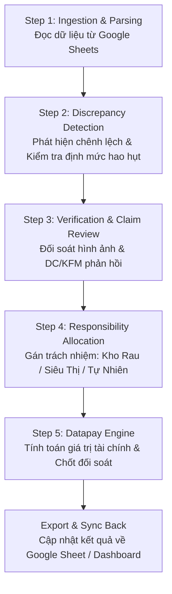
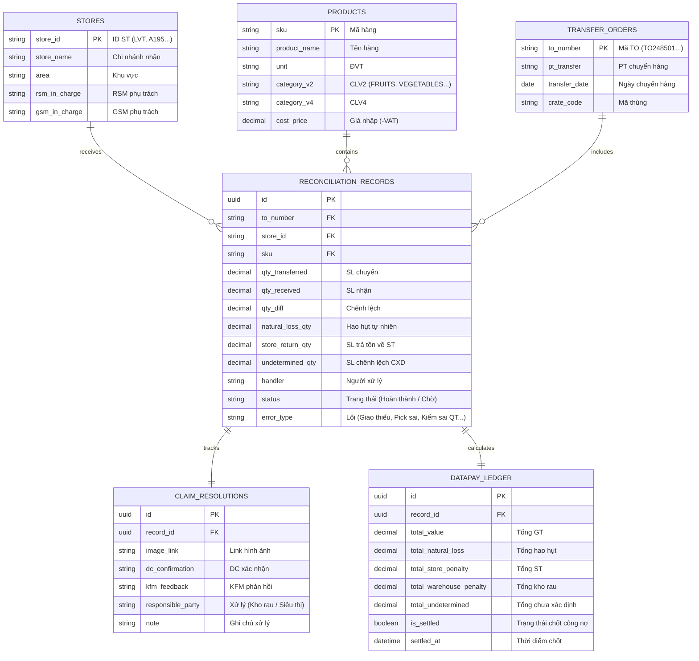

# Kế Hoạch Xây Dựng Tool Đối Soát Kho Rau & Tự Động Hóa Dữ Liệu (Tháng 09/2026)

Tài liệu này đề xuất kiến trúc, phân luồng quy trình (Flow), mô hình cơ sở dữ liệu (Database Schema) và các bước kỹ thuật để xây dựng Tool Đối Soát Kho Rau, kết nối dữ liệu trực tiếp từ **Google Sheets** và tích hợp cơ chế tự động đồng bộ mã nguồn lên **GitHub**.

---

## 1. Mục Tiêu & Phạm Vi Dự Án

- **Tự động hóa mã nguồn**: Thiết lập Git repository, cấu hình cơ chế tự động commit & push lên GitHub theo link repository của người dùng.
- **Tự động hóa luồng dữ liệu (Data Pipeline)**: Lấy dữ liệu tự động từ bảng tính Google Sheet đối soát (Spreadsheet ID: `1XBNLjZLsgaaHDBqVKsbCSYhzD4v-4qMA6rjGXGG4ThM`).
- **Phân luồng nghiệp vụ & Tính Datapay chính xác**:
  - Chuẩn hóa quy trình theo từng tab và từng step: từ lúc giao nhận TO/PT, ghi nhận chênh lệch, đối chiếu hình ảnh/camera, thẩm định lỗi, đến phân bổ trách nhiệm (Kho Rau vs. Siêu Thị vs. Hao Hụt Tự Nhiên).
  - Tự động hóa tính toán **Datapay** (giá trị bồi hoàn, bù trừ công nợ, xuất toán tồn kho) dựa trên giá nhập và số lượng chênh lệch thực tế.

---

## 2. Phân Luồng Nghiệp Vụ (Flow Chi Tiết Theo Tab & Step)

Dựa trên dữ liệu thực tế tại sheet `Đối Soát Kho Rau`, luồng xử lý của hệ thống được chuẩn hóa thành **5 Step** tương ứng với các trạng thái dữ liệu:

### Chi tiết từng Step:

| Step | Tên Bước | Nghiệp Vụ Xử Lý | Dữ Liệu Đầu Vào / Đầu Ra |
| :--- | :--- | :--- | :--- |
| **Step 1** | **Ingestion & Tab Mapping** | Đọc dữ liệu định kỳ từ Google Sheets qua Google Sheets API hoặc Service Account; chuẩn hóa format ngày tháng, số thập phân (dấu phẩy/chấm), loại bỏ dòng tiêu đề thừa. | Input: Sheet Gốc. Output: Raw Normalized Records. |
| **Step 2** | **Phát hiện chênh lệch & Hao hụt tự nhiên** | - So sánh `SL chuyển` và `SL nhận`. - Tính toán tỷ lệ chênh lệch `% Hao hụt`. - Kiểm tra ngưỡng hao hụt tự nhiên theo danh mục (`CLV2`: FRUITS, VEGETABLES, BAKERY...). | Rule: Nếu chênh lệch <= % định mức tự nhiên -> Ghi nhận `Hao hụt tự nhiên`. Nếu vượt ngưỡng -> Chuyển sang diện Claim/Lệch. |
| **Step 3** | **Đối chiếu Phản hồi & Bằng chứng** | - Kiểm tra các phiếu yêu cầu hoàn tồn (`PT Trả tồn về ST`, `PT trả tồn về DC`, `PT DC pick dư`). - Gắn link bằng chứng: `Link hình ảnh`, biên bản, camera checking. - Ghi nhận trạng thái phản hồi: `DC xác nhận` (Đồng ý claim, Từ chối claim, Kiểm tra lại) & `KFM phản hồi`. | Trạng thái: Chờ DC duyệt, Chờ KFM quyết định, Cấp HLV quyết định, Hoàn thành. |
| **Step 4** | **Phân loại Lỗi & Quy trách nhiệm** | Phân loại nguyên nhân lỗi theo danh mục chuẩn: 1. `Thiếu Item trong kiện` (DC giao thiếu / DC Pick sai) 2. `ST kiểm sai QT` / `ST nhập thiếu` 3. `Hao hụt tự nhiên` (trọng lượng bay hơi) 4. `Giao thừa / Pick dư` 5. `Chưa xác định (CXD)`. | Gán đơn vị chịu phạt/bồi hoàn: - `Kho rau` chịu trách nhiệm. - `Siêu thị` chịu trách nhiệm. - Chi phí hao hụt công ty chịu. |
| **Step 5** | **Datapay Engine (Tính toán Tài chính)** | Áp công thức tài chính chính xác tuyệt đối: - **Tổng GT**: `SL chênh lệch * Giá nhập (-VAT)` - **Tổng Hao hụt**: `SL hao hụt tự nhiên * Giá nhập` - **Tổng ST**: `SL lỗi do ST * Giá nhập` - **Tổng Kho rau**: `SL lỗi do Kho * Giá nhập` - **Tổng Chưa xác định**: `SL chưa phân định * Giá nhập`. | Kết xuất bảng công nợ Datapay phục vụ kế toán chuyển tiền/khấu trừ lương/hạch toán ERP. |

---

## 3. Thiết Kế Cơ Sở Dữ Liệu (Database Schema)

Để đảm bảo dữ liệu xử lý nhanh, không bị xung đột khi nhiều người cùng thao tác trên Google Sheets, dữ liệu sẽ được cấu trúc trong SQL (PostgreSQL / SQLite):

---

## 4. Kế Hoạch Triển Khai Kỹ Thuật (Architecture & Tools)

### Bước 1: Setup Môi Trường & Tự Động Hóa Git / GitHub
1. **Cài đặt công cụ nền tảng**:
   - Cài đặt `Git` và `Python 3.11+` trên máy qua `winget`.
   - Khởi tạo thư mục dự án cục bộ tại: `C:\Users\longa\.gemini\antigravity-ide\scratch\kho-rau-reconciliation`.
2. **Cấu hình Git Remote & Auto-Push**:
   - Khởi tạo Git repository (`git init`).
   - Kết nối với GitHub repository của bạn qua GitHub Personal Access Token (PAT) hoặc SSH.
   - Viết script tự động push (`scripts/auto_push.ps1` hoặc `auto_push.py`): Tự động phát hiện thay đổi mã nguồn, commit theo chuẩn Conventional Commits và push lên GitHub.

### Bước 2: Module Đồng Bộ Google Sheets (Sheets Ingestion Engine)
1. Cấu hình kết nối Google Sheet thông qua Service Account / Google Sheets API v4 (hoặc export endpoint tự động).
2. Xây dựng Data Parser xử lý các quy tắc đặc thù:
   - Làm sạch số thập phân tiếng Việt dạng `"14,80"` -> `14.80`.
   - Làm sạch định dạng tiền tệ `"19.000"` -> `19000.0`.
   - Xử lý các dòng gộp header (hàng 9, 10, 11, 12).
3. Đảm bảo chế độ Sync 2 chiều (nếu cần): Đọc dữ liệu thô -> Xử lý dữ liệu -> Đẩy báo cáo Datapay trở lại Sheet Báo Cáo.

### Bước 3: Datapay & Reconciliation Core Engine
1. Viết bộ quy tắc đối soát tự động:
   - Rule tự tính chênh lệch: $\Delta = SL_{\text{chuyển}} - SL_{\text{nhận}}$.
   - Rule kiểm tra ngưỡng hao hụt tự nhiên cho từng nhóm hàng.
   - Rule phân loại trách nhiệm bồi hoàn dựa trên phản hồi của DC và KFM.
2. Bộ tính toán Datapay tài chính:
   - Tính toán chính xác giá trị phát sinh của từng dòng và tổng hợp theo từng Siêu thị, từng Đội vận chuyển, từng Ngày giao hàng.

### Bước 4: Giao Diện Quản Trị / Báo Cáo (Web Dashboard / CLI)
- Cung cấp giao diện dashboard trực quan (Web UI nhẹ) hoặc CLI:
  - Xem danh sách đơn lệch theo ngày/chi nhánh.
  - Bộ lọc: Đơn chờ DC duyệt, Đơn chưa xác định, Đơn phạt Kho rau, Đơn phạt Siêu thị.
  - Nút bấm: "Đồng bộ từ Google Sheets", "Chốt Datapay tháng", "Xuất báo cáo Excel / Google Sheets".

---

## 5. Kế Hoạch Xác Thực (Verification Plan)

### Kiểm Thử Tự Động (Automated Testing):
- **Unit Test Engine Datapay**: Chạy kiểm tra tính toán tiền đối soát với các kịch bản mẫu từ dòng 13 đến 100 của Google Sheet (ví dụ: Dưa hấu ruột đỏ, Trứng gà sạch Tafa, v.v.).
- **Integration Test Sheet Sync**: Kiểm tra độ trễ và tính toàn vẹn dữ liệu khi fetch từ Google Sheets.
- **Git Auto-push Test**: Chạy thử nghiệm script auto-commit và auto-push lên repository GitHub mục tiêu.

### Kiểm Thử Nghiệp Vụ Thủ Công (Manual Verification):
- So sánh bảng Datapay xuất ra từ tool với số liệu chốt mẫu trên Google Sheet để đảm bảo không lệch dù chỉ 1 đồng.
- Kiểm tra tính thân thiện và bảo mật token kết nối GitHub / Google API.

---

## 6. Các Bước Cần Ny Phê Duyệt Để Bắt Đầu Thực Hiện

> [!IMPORTANT]
> **Để tiến hành cài đặt và viết code ngay lập tức, xin bạn xác nhận:**
> 1. Đường dẫn cụ thể repository GitHub mục tiêu (hoặc bạn muốn tạo một repo mới trên tài khoản GitHub của mình)?
> 2. Bạn muốn công cụ có giao diện Web trực quan (Dashboard hiển thị các bảng số liệu, bộ lọc và nút đồng bộ) hay chỉ cần script chạy tự động nền?
